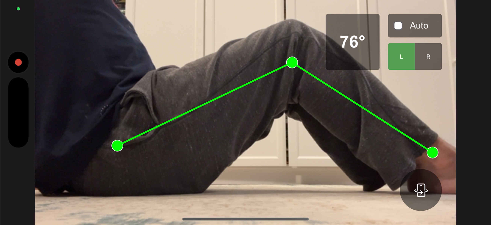

# Snap-Flex

A knee flexion angle measurement application that uses TensorFlow.js and MoveNet for pose detection. All computations are done client-side in the browser. No data is sent to a server.


The knee flexion angle is the angle formed between an imaginary straight line extending from your thigh bone (femur) and your shin bone (tibia) when you bend your knee. A fully straight (extended) knee has a flexion angle of 0 degrees and most people can comfortably bend their knee to about 135 to 140 degrees.


# Usage


1. Click the "Start Camera" button and wait for initialization to complete
2. Put the camera approximately 1 meter away from you in a level position
3. Position yourself in front of the camera horizontally on your back and facing the camera sideways so that your ankle, knee, and hip are visible on the screen
4. The application will detect your pose and calculate the knee flexion angle (not the knee angle that is etween the thigh and the calf, but )
5. Use the knee selection controls to choose which knee to track (left, right, or auto)
6. Optionally, click share on your browser and add to home screen to use the app as a standalone app on your mobile device.




# Development Setup

## Prerequisites

- Node.js (v14 or higher)
- npm or yarn
- OpenSSL (for generating SSL certificates)

## Installation

1. Clone the repository
2. Install dependencies:
   ```
   npm install
   ```

## Running the Application

### Standard Development Server

```
npm run dev
```

This will start the development server on http://localhost:5173 (or another port if 5173 is in use).

### HTTPS Development Server (Recommended for Mobile Testing)

For mobile browser testing, especially for camera access, you need to run the server with HTTPS:

1. Generate self-signed SSL certificates:
   ```
   npm run generate-certs
   ```

2. Start the development server with HTTPS:
   ```
   npm run dev:https
   ```

3. Access the application at https://localhost:5173 (or another port if 5173 is in use)

**Note:** Since the certificates are self-signed, you will see a security warning in your browser. You need to:
- Click "Advanced" and then "Proceed to localhost (unsafe)" in Chrome
- Click "Accept the Risk and Continue" in Firefox


## Building for Production

```
npm run build
```

This will create a production-ready build in the `dist` directory.
